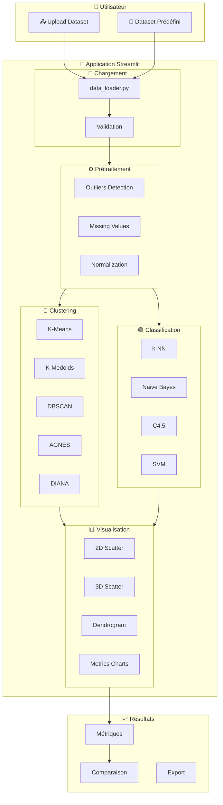

# 🔬 Data Mining Explorer

> **Application pédagogique interactive de Clustering & Classification**  
> Semestre 7 - Université des Sciences et de la Technologie d'Oran

[](https://streamlit.io)
[](https://python.org)
[](https://scikit-learn.org)
[](https://docker.com)

Une application web interactive permettant d'explorer, comparer et comprendre les algorithmes de **clustering** et de **classification supervisée** sur des jeux de données réels ou personnalisés.

---

## 📸 Aperçu de l'Application

### Prétraitement des Données
<p align="center">
  
</p>

### Clustering
<table>
  <tr>
    <td width="50%"></td>
    <td width="50%"></td>
  </tr>
  <tr>
    <td align="center"><em>Visualisation 3D des clusters</em></td>
    <td align="center"><em>Métriques d'évaluation</em></td>
  </tr>
</table>

### Classification Supervisée
<table>
  <tr>
    <td width="50%"></td>
    <td width="50%"></td>
  </tr>
  <tr>
    <td align="center"><em>Résultats de classification</em></td>
    <td align="center"><em>Comparaison des algorithmes</em></td>
  </tr>
</table>

---

## 🎯 Fonctionnalités Principales

### ✅ Chargement des Données
- **6 datasets prédéfinis** prêts à l'emploi (IRIS, Breast Cancer, Heart Disease, etc.)
- **Upload personnalisé** de fichiers CSV/Excel
- Détection automatique des valeurs manquantes
- Aperçu statistique (5-number summary)

### ✅ Prétraitement Intelligent
- Suppression des outliers (IQR, Z-score)
- Gestion des valeurs manquantes (suppression, moyenne, médiane, mode)
- Normalisation (Min-Max, Z-score, Robust Scaler)
- Sauvegarde de multiples versions prétraitées

### ✅ Clustering Non-Supervisé
- 5 algorithmes : K-Means, K-Medoids, DBSCAN, AGNES, DIANA
- Détection automatique des meilleurs paramètres
- Métriques : Silhouette, Calinski-Harabasz, Davies-Bouldin

### ✅ Classification Supervisée
- 4 algorithmes : k-NN, Naive Bayes, C4.5, SVM
- Évaluation k de 1 à 10 pour k-NN
- Métriques : Précision, Rappel, F-mesure, Matrice de confusion

### ✅ Visualisations Interactives
- Scatter plots 2D/3D avec Plotly
- Dendrogrammes pour clustering hiérarchique
- Courbes Elbow et Silhouette
- Graphiques k-distance pour DBSCAN

### ✅ Validation Intelligente
- Détection des cas impossibles (données continues pour classification)
- Alertes pour valeurs manquantes
- Contraintes d'algorithmes respectées

---

## 🗺️ Architecture de l'Application



---

## 📁 Structure du Projet

```
DM-Project/
├── app.py                 # Point d'entrée principal
├── requirements.txt       # Dépendances Python
├── Dockerfile            # Configuration Docker
├── docker-compose.yaml   # Orchestration Docker
│
├── config/               # Configuration
│   ├── constants.py      # Constantes & datasets prédéfinis
│   └── settings.py       # Paramètres application
│
├── utils/                # Utilitaires
│   ├── data_loader.py    # Chargement & validation données
│   ├── preprocessing.py  # Transformations données
│   └── metrics.py        # Calculs métriques
│
├── clustering/           # Algorithmes de clustering
│   ├── kmeans.py         # K-Means
│   ├── kmedoids.py       # K-Medoids
│   ├── dbscan.py         # DBSCAN
│   ├── agnes.py          # AGNES (hiérarchique ↑)
│   └── diana.py          # DIANA (hiérarchique ↓)
│
├── classification/       # Algorithmes de classification
│   ├── knn.py            # k-NN
│   ├── naive_bayes.py    # Naive Bayes
│   ├── decision_tree.py  # C4.5
│   └── svm.py            # SVM
│
├── components/           # Composants UI Streamlit
│   ├── sidebar.py        # Sidebar clustering
│   ├── classification_sidebar.py
│   ├── tabs.py           # Onglets clustering
│   └── classification_tabs.py
│
├── visualization/        # Visualisations
│   ├── plots.py          # Graphiques Plotly
│   └── colors.py         # Palettes couleurs
│
└── datasets/             # Datasets prédéfinis
    ├── IRIS 1.csv
    ├── breast.csv
    ├── heart.csv
    └── ...
```

---

## 🤖 Algorithmes Disponibles

### 🔵 Clustering (Non-Supervisé)

| Algorithme | Type | Description | Paramètres |
|:-----------|:-----|:------------|:-----------|
| **K-Means** | Partitionnement | Minimise l'inertie intra-cluster via centroïdes | `n_clusters`, `init` |
| **K-Medoids** | Partitionnement | Utilise des médoïdes (robuste aux outliers) | `n_clusters`, `metric` |
| **DBSCAN** | Densité | Détecte clusters de forme arbitraire + bruit | `eps`, `min_samples` |
| **AGNES** | Hiérarchique ↑ | Agglomération ascendante (bottom-up) | `n_clusters`, `linkage` |
| **DIANA** | Hiérarchique ↓ | Division descendante (top-down) | `n_clusters`, `metric` |

### 🟢 Classification (Supervisée)

| Algorithme | Type | Description | Paramètres |
|:-----------|:-----|:------------|:-----------|
| **k-NN** | Instance-based | Vote majoritaire des k plus proches voisins | `k`, `metric`, `weights` |
| **Naive Bayes** | Probabiliste | Classifieur bayésien avec indépendance naïve | `type` (gaussian/multinomial/bernoulli) |
| **C4.5** | Arbre de décision | Gain d'information / ratio de gain | `criterion`, `max_depth`, `min_samples` |
| **SVM** | Marge maximale | Hyperplan séparateur optimal | `kernel`, `C`, `gamma` |

---

## 📊 Datasets Prédéfinis

| Dataset | Instances | Features | Classes | Valeurs Manquantes | Recommandé Pour |
|:--------|:---------:|:--------:|:-------:|:------------------:|:----------------|
| 🌸 **IRIS** | 150 | 4 | 3 | ❌ Non | Clustering, Classification |
| 🎗️ **Breast Cancer** | 569 | 18 | 2 | ❌ Non | Clustering, Classification |
| ❤️ **Heart Disease** | 303 | 13 | 2 | ❌ Non | Clustering, Classification |
| 🦠 **Ecoli** | 336 | 7 | 8 | ❌ Non | Clustering, Classification |
| 🏥 **Hepatitis** | 155 | 19 | 2 | ⚠️ Oui | Classification (après prétraitement) |
| 🐴 **Horse Colic** | 300 | 27 | 3 | ⚠️ Oui | Classification (après prétraitement) |

---

## 📈 Métriques d'Évaluation

### Clustering

| Métrique | Plage | Optimal | Interprétation |
|:---------|:-----:|:-------:|:---------------|
| **Silhouette Score** | [-1, 1] | → 1 | Mesure cohésion vs séparation |
| **Calinski-Harabasz** | [0, +∞) | ↑ Haut | Ratio variance inter/intra cluster |
| **Davies-Bouldin** | [0, +∞) | ↓ Bas | Similarité moyenne entre clusters |
| **Inertie (WCSS)** | [0, +∞) | ↓ Bas | Somme des distances² intra-cluster |

### Classification

| Métrique | Formule | Interprétation |
|:---------|:--------|:---------------|
| **Accuracy** | (TP+TN) / Total | Taux de prédictions correctes |
| **Précision** | TP / (TP+FP) | Fiabilité des prédictions positives |
| **Rappel** | TP / (TP+FN) | Capacité à trouver tous les positifs |
| **F1-Score** | 2×(P×R)/(P+R) | Moyenne harmonique précision/rappel |

---

## 🚀 Installation

### Prérequis

- **Python 3.11+**
- **pip** (gestionnaire de paquets Python)

### Installation Locale

```bash
# 1. Cloner le repository
git clone https://github.com/Noussour/dm-project.git
cd dm-project

# 2. Créer un environnement virtuel (recommandé)
python -m venv .venv

# Activer l'environnement
source .venv/bin/activate      # macOS/Linux
# .venv\Scripts\activate       # Windows

# 3. Installer les dépendances
pip install -r requirements.txt

# 4. Lancer l'application
streamlit run app.py
```

🌐 **Accès** : http://localhost:8501

### 🐳 Installation Docker

```bash
# Option 1: Docker Compose (recommandé)
docker-compose up --build

# Option 2: Docker direct
docker build -t dm-explorer .
docker run -p 8501:8501 dm-explorer
```

---

## 💻 Guide d'Utilisation

### Étape 1 : Charger les Données

1. **Dataset prédéfini** : Sélectionnez dans le menu déroulant et cliquez "Charger"
2. **Upload** : Glissez-déposez un fichier CSV/Excel

### Étape 2 : Prétraitement (si nécessaire)

1. Naviguez vers l'onglet **Prétraitement**
2. Configurez :
   - **Outliers** : IQR ou Z-score
   - **Valeurs manquantes** : Suppression, moyenne, médiane, mode
   - **Normalisation** : Min-Max, Z-score, Robust
3. Cliquez **Exécuter le pipeline**

### Étape 3 : Clustering

1. Naviguez vers **Clustering**
2. Sélectionnez l'algorithme (K-Means, DBSCAN, etc.)
3. Ajustez les paramètres ou cliquez **Meilleurs params**
4. Cliquez **Exécuter**
5. Explorez les onglets : Visualisation, Métriques, Graphiques

### Étape 4 : Classification

1. Naviguez vers **Classification**
2. Sélectionnez la **variable cible** (classes)
3. Configurez le **split train/test** (80/20 par défaut)
4. Choisissez l'algorithme
5. Cliquez **Classifier** ou **Comparer tous**

---

## ⚠️ Validation et Contraintes

L'application détecte automatiquement les cas problématiques :

| Situation | Action |
|:----------|:-------|
| Valeurs manquantes + Clustering | ❌ Bloque l'exécution |
| Variable cible continue | ❌ Erreur avec suggestion |
| Trop peu d'échantillons | ⚠️ Avertissement |
| Classes déséquilibrées | ⚠️ Avertissement |
| n_clusters ≥ n_samples | ❌ Erreur de paramètre |
| Dendrogramme > 1000 points | ⚠️ Désactivé |

---

## 🛠️ Technologies

| Technologie | Version | Rôle |
|:------------|:-------:|:-----|
| **Streamlit** | 1.28+ | Framework UI web |
| **scikit-learn** | Latest | Algorithmes ML |
| **Plotly** | Latest | Visualisations interactives |
| **Pandas** | Latest | Manipulation données |
| **NumPy** | Latest | Calculs numériques |
| **SciPy** | Latest | Clustering hiérarchique |
| **Matplotlib/Seaborn** | Latest | Graphiques statiques |

---

## 📝 Notes Pédagogiques

Cette application a été développée pour permettre aux étudiants de :

1. **Comprendre** les différences fondamentales entre algorithmes
2. **Visualiser** l'impact des hyperparamètres sur les résultats
3. **Comparer** objectivement les performances via métriques standardisées
4. **Explorer** le prétraitement et son importance sur la qualité des modèles
5. **Apprendre** les bonnes pratiques (validation, split train/test, etc.)