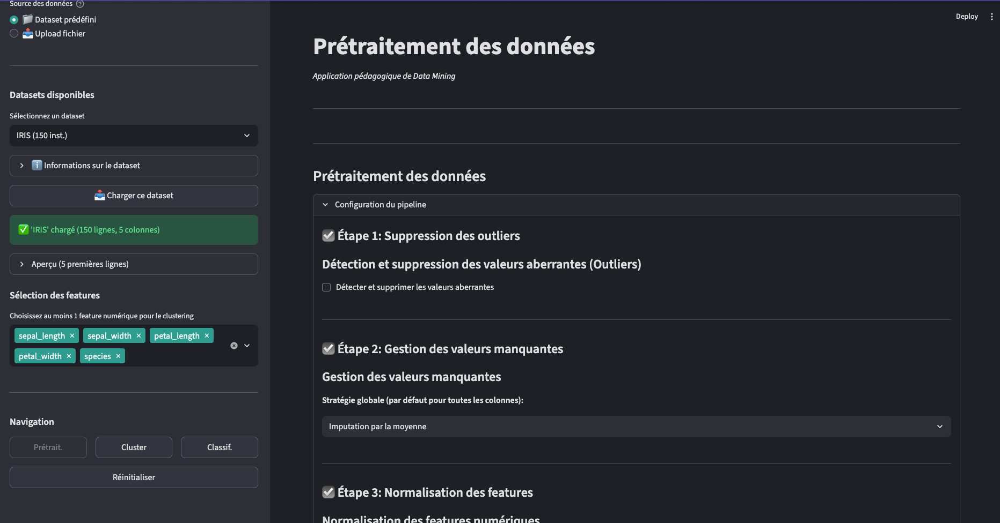
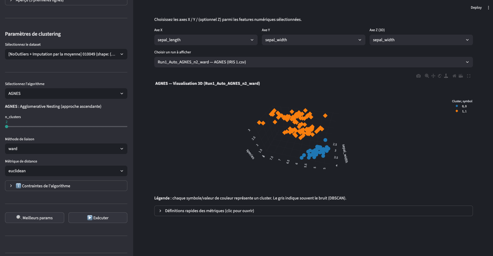
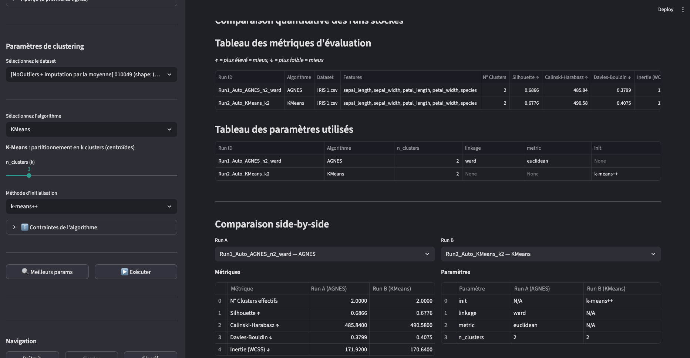
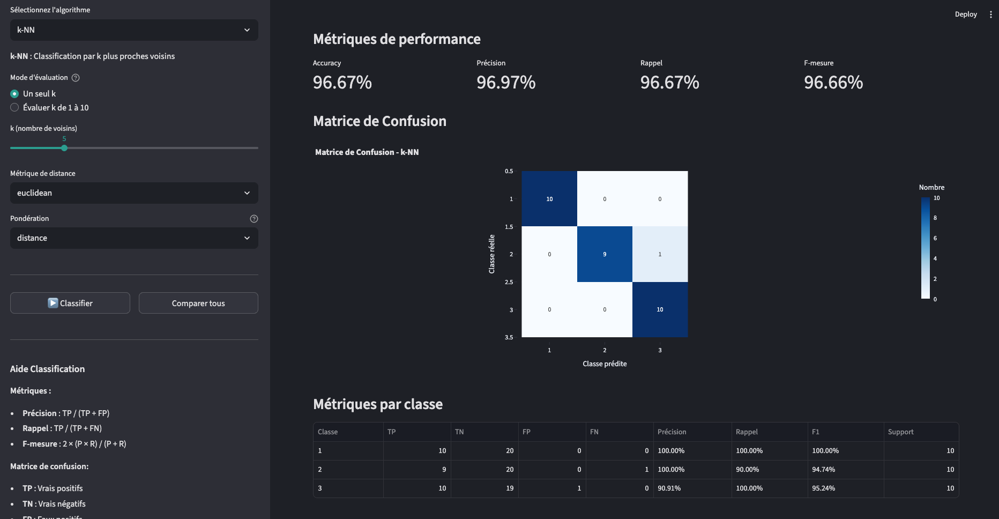
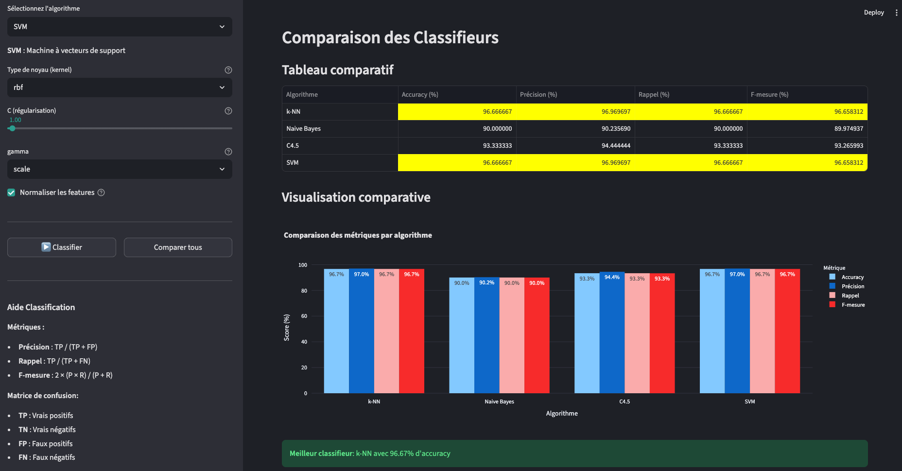
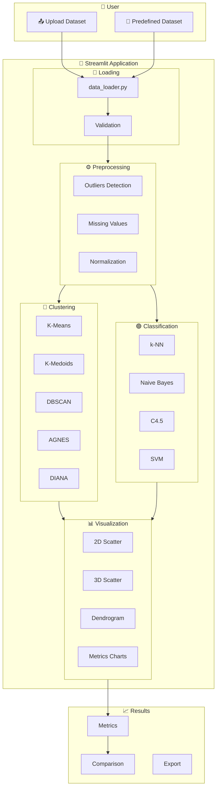

# 🔬 Data Mining Explorer

> **Interactive Educational Clustering & Classification Application**  
> Semester 7 - University of Science and Technology of Oran

[](https://streamlit.io)
[](https://python.org)
[](https://scikit-learn.org)
[](https://docker.com)

An interactive web application allowing users to explore, compare, and understand **clustering** and **supervised classification** algorithms on real or custom datasets.

---

## 📸 Application Overview

### Data Preprocessing
<p align="center">
  
</p>

### Clustering
<table>
  <tr>
    <td width="50%"></td>
    <td width="50%"></td>
  </tr>
  <tr>
    <td align="center"><em>3D Cluster Visualization</em></td>
    <td align="center"><em>Evaluation Metrics</em></td>
  </tr>
</table>

### Supervised Classification
<table>
  <tr>
    <td width="50%"></td>
    <td width="50%"></td>
  </tr>
  <tr>
    <td align="center"><em>Classification Results</em></td>
    <td align="center"><em>Algorithm Comparison</em></td>
  </tr>
</table>

---

## 🎯 Key Features

### ✅ Data Loading
- **6 predefined datasets** ready to use (IRIS, Breast Cancer, Heart Disease, etc.)
- **Custom upload** of CSV/Excel files
- Automatic detection of missing values
- Statistical overview (5-number summary)

### ✅ Smart Preprocessing
- Outlier removal (IQR, Z-score)
- Missing value handling (deletion, mean, median, mode)
- Normalization (Min-Max, Z-score, Robust Scaler)
- Saving simple preprocessed versions

### ✅ Unsupervised Clustering
- 5 algorithms: K-Means, K-Medoids, DBSCAN, AGNES, DIANA
- Automatic detection of best parameters
- Metrics: Silhouette, Calinski-Harabasz, Davies-Bouldin

### ✅ Supervised Classification
- 4 algorithms: k-NN, Naive Bayes, C4.5, SVM
- Evalution of k from 1 to 10 for k-NN
- Metrics: Precision, Recall, F-measure, Confusion Matrix

### ✅ Interactive Visualizations
- 2D/3D Scatter plots with Plotly
- Dendrograms for hierarchical clustering
- Elbow and Silhouette curves
- k-distance graphs for DBSCAN

### ✅ Smart Validation
- Detection of impossible cases (continuous data for classification)
- Alerts for missing values
- Respected algorithm constraints

---

## 🗺️ Application Architecture



---

## 📁 Project Structure

```
DM-Project/
├── app.py                 # Main entry point
├── requirements.txt       # Python dependencies
├── Dockerfile            # Docker configuration
├── docker-compose.yaml   # Docker orchestration
│
├── config/               # Configuration
│   ├── constants.py      # Constants & predefined datasets
│   └── settings.py       # Application settings
│
├── utils/                # Utilities
│   ├── data_loader.py    # Data loading & validation
│   ├── preprocessing.py  # Data transformations
│   └── metrics.py        # Metrics calculations
│
├── clustering/           # Clustering algorithms
│   ├── kmeans.py         # K-Means
│   ├── kmedoids.py       # K-Medoids
│   ├── dbscan.py         # DBSCAN
│   ├── agnes.py          # AGNES (hierarchical ↑)
│   └── diana.py          # DIANA (hierarchical ↓)
│
├── classification/       # Classification algorithms
│   ├── knn.py            # k-NN
│   ├── naive_bayes.py    # Naive Bayes
│   ├── decision_tree.py  # C4.5
│   └── svm.py            # SVM
│
├── components/           # Streamlit UI Components
│   ├── sidebar.py        # Clustering sidebar
│   ├── classification_sidebar.py
│   ├── tabs.py           # Clustering tabs
│   └── classification_tabs.py
│
├── visualization/        # Visualizations
│   ├── plots.py          # Plotly charts
│   └── colors.py         # Color palettes
│
└── datasets/             # Predefined datasets
    ├── IRIS 1.csv
    ├── breast.csv
    ├── heart.csv
    └── ...
```

---

## 🤖 Available Algorithms

### 🔵 Clustering (Unsupervised)

| Algorithm | Type | Description | Parameters |
|:-----------|:-----|:------------|:-----------|
| **K-Means** | Partitioning | Minimizes intra-cluster inertia via centroids | `n_clusters`, `init` |
| **K-Medoids** | Partitioning | Uses medoids (robust to outliers) | `n_clusters`, `metric` |
| **DBSCAN** | Density | Detects arbitrarily shaped clusters + noise | `eps`, `min_samples` |
| **AGNES** | Hierarchical ↑ | Ascending agglomeration (bottom-up) | `n_clusters`, `linkage` |
| **DIANA** | Hierarchical ↓ | Descending division (top-down) | `n_clusters`, `metric` |

### 🟢 Classification (Supervised)

| Algorithm | Type | Description | Parameters |
|:-----------|:-----|:------------|:-----------|
| **k-NN** | Instance-based | Majority vote of k nearest neighbors | `k`, `metric`, `weights` |
| **Naive Bayes** | Probabilistic | Bayesian classifier with naive independence | `type` (gaussian/multinomial/bernoulli) |
| **C4.5** | Decision Tree | Information gain / gain ratio | `criterion`, `max_depth`, `min_samples` |
| **SVM** | Maximum Margin | Optimal separating hyperplane | `kernel`, `C`, `gamma` |

---

## 📊 Predefined Datasets

| Dataset | Instances | Features | Classes | Missing Values | Recommended For |
|:--------|:---------:|:--------:|:-------:|:------------------:|:----------------|
| 🌸 **IRIS** | 150 | 4 | 3 | ❌ No | Clustering, Classification |
| 🎗️ **Breast Cancer** | 569 | 18 | 2 | ❌ No | Clustering, Classification |
| ❤️ **Heart Disease** | 303 | 13 | 2 | ❌ No | Clustering, Classification |
| 🦠 **Ecoli** | 336 | 7 | 8 | ❌ No | Clustering, Classification |
| 🏥 **Hepatitis** | 155 | 19 | 2 | ⚠️ Yes | Classification (after preprocessing) |
| 🐴 **Horse Colic** | 300 | 27 | 3 | ⚠️ Yes | Classification (after preprocessing) |

---

## 📈 Evaluation Metrics

### Clustering

| Metric | Range | Optimal | Interpretation |
|:---------|:-----:|:-------:|:---------------|
| **Silhouette Score** | [-1, 1] | → 1 | Measures cohesion vs separation |
| **Calinski-Harabasz** | [0, +∞) | ↑ High | Inter/intra cluster variance ratio |
| **Davies-Bouldin** | [0, +∞) | ↓ Low | Average similarity between clusters |
| **Inertia (WCSS)** | [0, +∞) | ↓ Low | Sum of intra-cluster squared distances |

### Classification

| Metric | Formula | Interpretation |
|:---------|:--------|:---------------|
| **Accuracy** | (TP+TN) / Total | Correct prediction rate |
| **Precision** | TP / (TP+FP) | Reliability of positive predictions |
| **Recall** | TP / (TP+FN) | Ability to find all positives |
| **F1-Score** | 2×(P×R)/(P+R) | Harmonic mean of precision/recall |

---

## 🚀 Installation

### Prerequisites

- **Python 3.11+**
- **pip** (Python package manager)

### Local Installation

```bash
# 1. Clone the repository
git clone https://github.com/Noussour/dm-project.git
cd dm-project

# 2. Create a virtual environment (recommended)
python -m venv .venv

# Activate the environment
source .venv/bin/activate      # macOS/Linux
# .venv\Scripts\activate       # Windows

# 3. Install dependencies
pip install -r requirements.txt

# 4. Run the application
streamlit run app.py
```

🌐 **Access**: http://localhost:8501

### 🐳 Docker Installation

```bash
# Option 1: Docker Compose (recommended)
docker-compose up --build

# Option 2: Docker direct
docker build -t dm-explorer .
docker run -p 8501:8501 dm-explorer
```

---

## 💻 User Guide

### Step 1: Load Data

1. **Predefined Dataset**: Select from the dropdown and click "Load"
2. **Upload**: Drag and drop a CSV/Excel file

### Step 2: Preprocessing (if necessary)

1. Navigate to the **Preprocessing** tab
2. Configure:
   - **Outliers**: IQR or Z-score
   - **Missing Values**: Deletion, mean, median, mode
   - **Normalization**: Min-Max, Z-score, Robust
3. Click **Run Pipeline**

### Step 3: Clustering

1. Navigate to **Clustering**
2. Select the algorithm (K-Means, DBSCAN, etc.)
3. Adjust parameters or click **Best Params**
4. Click **Run**
5. Explore the tabs: Visualization, Metrics, Charts

### Step 4: Classification

1. Navigate to **Classification**
2. Select the **target variable** (classes)
3. Configure **train/test split** (80/20 default)
4. Choose the algorithm
5. Click **Classify** or **Compare All**

---

## ⚠️ Validation and Constraints

The application automatically detects problematic cases:

| Situation | Action |
|:----------|:-------|
| Missing values + Clustering | ❌ Blocks execution |
| Continuous target variable | ❌ Error with suggestion |
| Too few samples | ⚠️ Warning |
| Imbalanced classes | ⚠️ Warning |
| n_clusters ≥ n_samples | ❌ Parameter error |
| Dendrogram > 1000 points | ⚠️ Disabled |

---

## 🛠️ Technologies

| Technology | Version | Role |
|:------------|:-------:|:-----|
| **Streamlit** | 1.28+ | Web UI Framework |
| **scikit-learn** | Latest | ML Algorithms |
| **Plotly** | Latest | Interactive Visualizations |
| **Pandas** | Latest | Data Manipulation |
| **NumPy** | Latest | Numerical Calculations |
| **SciPy** | Latest | Hierarchical Clustering |
| **Matplotlib/Seaborn** | Latest | Static Charts |

---

## 📝 Educational Notes

This application was developed to allow students to:

1. **Understand** the fundamental differences between algorithms
2. **Visualize** the impact of hyperparameters on results
3. **Compare** performance objectively via standardized metrics
4. **Explore** preprocessing and its importance on model quality
5. **Learn** best practices (validation, train/test split, etc.)